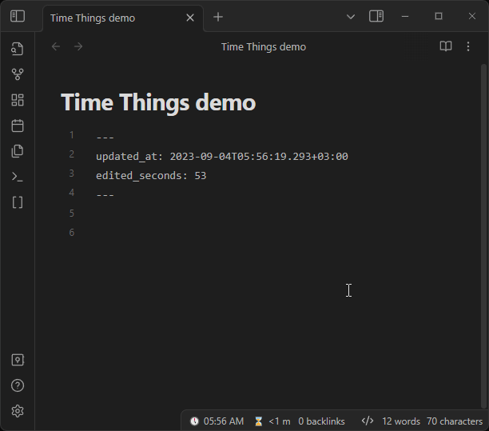
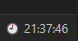

# Time Things

Know when your note was was last updated. Track how much time you spent writing. Keep an eye on the clock.

It's for people like me, who like to store as much metadata as possible. It might become useful when you are trying to reconstruct a session you've been working on. I also believe that it increases serendipity.

## Last edited timestamp

Time Things updates your chosen property with current timestamp on edit. When a note is modified, it updates the frontmatter.

It might be useful for gauging a maturity or relevancy of a note.

- Choose any property
- Choose the time format (default is ISO 8601)
- Choose your preffered timezone (supports search by a region or city) or use UTC
- Exclude folders or specific files

## Edited duration in seconds

Time Things calculates how long you've been working on a note and stores it inside the frontmatter.

The active note's total is also shown in the status bar as `⌛ 12 m`. You can disable
this item or customize its template in **Settings → Time Things → Status bar**. For
example, `⌛ {hours}h {minutesPart}m` displays total hours plus the remaining minutes.
The available tokens are `{duration}`, `{days}`, `{hours}`, `{minutes}`, `{seconds}`,
`{hoursPart}`, `{minutesPart}`, and `{secondsPart}`.

It might be useful for gauging an effort level you have put into any given note. You might surprise yourself with how much time you spent writing a TV show essay that never seen the light of day.

## Clock

Time Things displays a little clock in your status bar.

It might be useful for people, who have minimal OS interface when working with Obsidian, so they can't glance at a system clock. There is also an option to set it to your timezone of choice; or UTC. Which might come in handy if you work from home and your decentrilized team spans across multiple timezones.

## Privacy and security

Time Things does not send vault data or telemetry over the network.

The plugin enumerates Markdown files and folder paths inside the current vault. This access is used to build the **Most edited notes** view and to provide file and folder suggestions for the ignored-path settings. Note contents are read only when Time Things updates the configured frontmatter properties; ignored files and folders are excluded from tracking.

## Etc

### Format tokens

Clock and custom modified-timestamp formats support the following tokens. Text inside
square brackets is emitted literally.

| Token | Meaning |
| --- | --- |
| `YYYY` | Four-digit year |
| `MM` | Two-digit month |
| `DD` | Two-digit day |
| `HH` | Two-digit 24-hour hour |
| `H` | One- or two-digit 24-hour hour |
| `hh` | Two-digit 12-hour hour |
| `h` | One- or two-digit 12-hour hour |
| `mm` | Two-digit minute |
| `ss` | Two-digit second |
| `SSS` | Three-digit millisecond |
| `A` | Uppercase AM/PM |
| `a` | Lowercase am/pm |
| `Z` | UTC offset, such as `+05:30` |
| `[literal]` | Literal text |

### About custom frontmatter handling solution

Custom frontmatter handling solution is disabled by default since Obsidian's straightforward frontmatter API is much more stable and robust. However, advanced users may enable it if they wish.  Don't forget to regularly back up your vault.

#### Reasons to enable custom frontmatter handling solution

- It updates the value instantly
- It only touches one line, which means it never makes your cursor jump, or a message "A file has been modified" popup
- It doesn't reformat your frontmatter to fit any standard

#### Reasons to leave custom frontmatter handling solution disabled 

- You are using nested keys in the Time Things settings. Using custom frontmatter handling solution with a nested key may result in the wrong key being updated. This only happens if it comes before the needed key in the frontmatter and has a similar path. For example `x.y.z` will update `x.y.g.z` instead if it meets it first and if it has a value of a format specified in the settings.
- Existing null values or values in a format different from the configured timestamp format are not updated by the custom solution.

I may improve it further in the future, but for that I feel like I'd have to write a full-blown YAML parser from scratch. For now it covers my own wishes completely and even has some room for limited flexibility, so I will focus on other aspects of the plugin.

### What's next

- [x] Ignore files in specified folders
- [x] Track time spent editing a note
- [ ] Ingore files with specified frontmatter keys (and their values)
- [x] Pick a timezone for all things globally
- [x] Pick a timezone for clock and frontmatter separately
